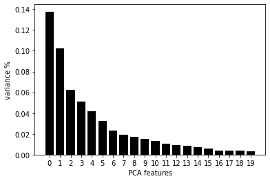
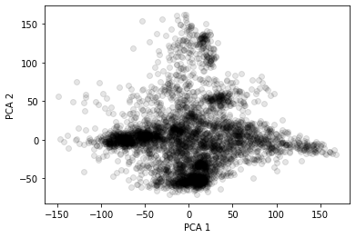
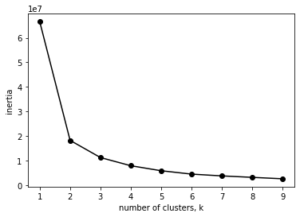
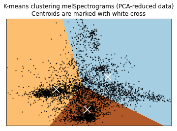
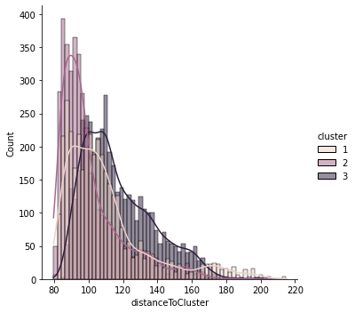
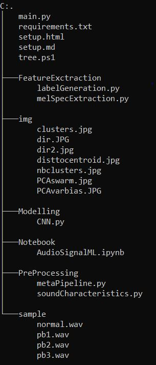
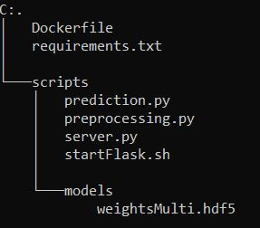

# Signal Machine Learning

This document will walk you through the concepts, ideas and scripts of this project. To reproduce the results you may navigate to the /tuto folder which contains all the necessary code as python script or notebook depending on your preference. The /deploy folder allows you to generate a docker image for real time inference, provided it has a trained model in hdf5 format in the /deploy/scripts/models folder.

Before we head in, a big thanks to the Hitachi team that created this awesome dataset! 

*Purohit, Harsh, Tanabe, Ryo, Ichige, Kenji, Endo, Takashi, Nikaido, Yuki, Suefusa, Kaori, & Kawaguchi, Yohei. (2019). MIMII Dataset: Sound Dataset for Malfunctioning Industrial Machine Investigation and Inspection (Version public 1.0) [Data set]. Presented at the 4th Workshop on Detection and Classification of Acoustic Scenes and Events (DCASE 2019 Workshop), New York, USA: Zenodo. http://doi.org/10.5281/zenodo.3384388*

You can find a very detailed document on how they produced the dataset and their approach to classifying its content here:
[10.5281/zenodo.3384388](http://doi.org/10.5281/zenodo.3384388)

## 1\. Intro & problem statement

The goal of this project is to be able to apply Machine Learning on sound recordings from a machine to obtain a model for real time inference on the Edge. Given this context, we have focused on developing a Machine Learning model for sound classification based on the MIMII dataset created by Hitachi.

In their expirement, they recorded the sound of various machines during normal functioning as well as during certain failures. For each type of machine they have recorded the sound of 4 seperate machines using eight microphones, adding three types of white noise independently (-6db, 0db, +6db). The sound recordings were saved in samples of 10s 0ms in .wav format. The .wav files are saved in either a "normal" or "abnormal" folder depending on wether the machine had an issue during recording. We have focused on one type of machine as this is a demo project, specifically on their sound recordings for a fan. They test for 3 types of problems for the fan: Voltage change, Imbalance and Clogging. The total dataset should amount to:

3 (Types of white noise) x 4 (Number of independent machines) x 2 (normal & abnormal folders for .wav files) = 24 subfolders

For more information on their expriment and the data:

https://zenodo.org/record/3384388

Although one could see the direct use of classifying normal & abnormal sounds of a machine, we took it one step further. We've developed a model that could not only identify abnormal sounds but infer what problem specifically is occuring, as we agreed it would be of bigger added value than classic binary classification.

## 2\. Azure ML Studio & Data set-up

The .wav files organized in their respective folders can be downloaded from the link above as .zip archives. The way we handled it, to avoid downloading locally then uploading to the cload, was to download them directly on our compute instance on Azure ML (you also get datacenter bandwidth for faster download). To do this, we simply open a terminal after launching our compute instance on AMLS. From there we either wget or curl the download links from the folders we previously created for each type of white noise added.

links for download : 
- https://zenodo.org/record/3384388/files/6_dB_fan.zip?download=1 
- https://zenodo.org/record/3384388/files/-6_dB_fan.zip?download=1 
- https://zenodo.org/record/3384388/files/0_dB_fan.zip?download=1


```bash
# install jar because classic unzip doesn't work too well
apt-get update
apt-get install fastjar

# create folders for each type of white noise, or do it directly in AMLS
mkdir data66db
mkdir data6db
mkdir data0db

# Download zip archives
# Before you download file, cd to the adequate folder
curl -L yourLinkHere -o fan.zip 

# unzip fan.zip
jar xvf fan.zip

# repeat for 3 types of white noise
```
You should now have 3 folders (data0db, data6db, data66db for each type of white noise) containing subfolders of all the independent machines themselves containing folders of normal and abnormal sounds.

## 3\. Pre-processing & feature extraction

A common approach to analysis & machine learning applied to audio is to use MelSpectrograms. In short, they are a numerical representation of a signal in both its time & frequency domain. I won't be detailing on the mathematical concepts behind it, but I do reccomend hevily to understand what they are before going on with the project. A good vulgarization can be found here: https://medium.com/analytics-vidhya/understanding-the-mel-spectrogram-fca2afa2ce53 In the article you will also find a link to a video from 3Blue1Brown on the Fourier Transform, an essential mathematical tool in the computation of a MelSpectrogram (highly recommended).

What we need to do is to compute the MelSpectrogram for every .wav file we have. To easily do this, we first generate metadata on the paths to each file, with the information on whether the sound is abnormal or not. The below class does exactly that and saves the metadata as .csv:

_tuto/PreProcessing/metaPipeline.py_
```python
import pandas as pd
import os
import glob


class PipelineMeta():


    def __init__(self):
        """
        Initialize class with paths to normal/abnormal .wav files
        """
        self.paths=[
    "data0db/fan/id_00",
    "data0db/fan/id_02",
    "data0db/fan/id_04",
    "data0db/fan/id_06",
    "data6db/fan/id_00",
    "data6db/fan/id_02",
    "data6db/fan/id_04",
    "data6db/fan/id_06",
    "data66db/fan/id_00",
    "data66db/fan/id_02",
    "data66db/fan/id_04",
    "data66db/fan/id_06",
]


    def datasetGenerator(self,
                        targetDir,
                        normalDirName="normal",
                        abnormalDirName="abnormal",
                        ext="wav"):
        """
        For a given path, define path to each .wav, noting information on normal/abnormal

        input

            targetDir: path to ind. machine
            normalDirName: name for normal .wav files
            abnormalDirName: name for abnormal .wav files
            ext: extension for audio files

        output 

            normalSet: pandas dataframe contaning file path to all normal .wav audio files of targetDir
            abnormalSet: same as normalSet, but for abnormal .wav
        """
        # 01 normal list generate
        normalFiles = sorted(glob.glob(
            os.path.abspath("{dir}/{normalDirName}/*.{ext}".format(dir=targetDir,
                                                                    normalDirName=normalDirName,
                                                                    ext=ext))))
        normalLabels = False

        # 02 abnormal list generate
        abnormalFiles = sorted(glob.glob(
            os.path.abspath("{dir}/{abnormalDirName}/*.{ext}".format(dir=targetDir,
                                                                    abnormalDirName=abnormalDirName,
                                                                    ext=ext))))
        abnormalLabels = True

        normalSet = pd.DataFrame({"filePath":normalFiles,"label":normalLabels})
        abnormalSet = pd.DataFrame({"filePath":abnormalFiles,"label":abnormalLabels})

        return normalSet, abnormalSet


    def metaGenerator(self, save=False, metaFileName="Meta.csv"):
        """
        Method to loop through all individual independent machines for all 3 types of added white noise

        input

            save: Boolean parameter to save output of method (metadata dataframe) as csv
            metaFileName: name for .csv if save=True

        output

            meta: Dataframe containing filepaths to every .wav in given paths (self.paths from __init__)
        """
        normalSet, abnormalSet = self.datasetGenerator(self.paths[0])
        meta = normalSet.append(abnormalSet) 
        for path in self.paths[1:]:
            normalSet, abnormalSet = self.datasetGenerator(path)
            meta = meta.append(normalSet.append(abnormalSet))
        if save:
            meta.to_csv(metaFileName, index=0)

        return meta


    def __str__(self):
        return 'class to retrieve filepath and sound type metadata and save as Pandas dataframe'


if __name__=='__main__':
    meta=PipelineMeta()
    meta.metaGenerator(save=True)
```

We also provide some script to investigate the characteristics of the .wav files:

_tuto/PreProcessing/soundCharacteristics.py_

```python
import struct
import pandas as pd
from metaPipeline import PipelineMeta


class WavFileHelper(PipelineMeta):


    def __init__(self, metaFileName='Meta.csv'):
        """
        Initialize class, try to load meta.csv containing filepath metadata 
        Upon failure inherit from PipelineMeta() and generate missing metadata

        input

            metaFileName: Name of saved metadata dataframe
        """
        try:
            self.wavMeta = pd.read_csv(metaFileName)
        except Exception as e:
            print(e, "\n", "meta.csv does not exist, generating it.")
            super().__init__()
            metaObj =  PipelineMeta()
            self.wavMeta = metaObj.metaGenerator(save=True)


    def FileProperties(self, filename):
        """
        Using struct library extract basic properties of given .wav file. 

        input

            filename: name of .wav to inspect

        output

            numChannels: Number of channels used to record audio
            sampleRate: Sample rate of audio
            bitDepth: Bit depth of audio file
        """
        waveFile = open(filename,"rb")
        riff = waveFile.read(12)
        fmt = waveFile.read(36)
        numChannelsString = fmt[10:12]
        numChannels = struct.unpack('<H', numChannelsString)[0]
        sampleRateString = fmt[12:16]
        sampleRate = struct.unpack("<I",sampleRateString)[0]
        bitDepthString = fmt[22:24]
        bitDepth = struct.unpack("<H",bitDepthString)[0]

        return (numChannels, sampleRate, bitDepth)


    def readFileProperties(self):           
        audioData = []
        for index, row in self.wavMeta.iterrows():
            fileName=row['filePath']
            data = self.FileProperties(fileName)
            audioData.append(data)
        audioDf = pd.DataFrame(audioData, columns=['numChannels','sampleRate','bitDepth'])
        numChannels = audioDf.numChannels.value_counts(normalize=True)
        sampleRate = audioDf.sampleRate.value_counts(normalize=True)
        bitDepth = audioDf.bitDepth.value_counts(normalize=True)
        characteristics = {
            "number of channels":numChannels,
            "sample rate":sampleRate,
            "bit depth":bitDepth
        }

        return characteristics


    def __str__(self):
        return 'Class to extract .wav properties (sample rate, num channels, bit depth)'


if __name__=="__main__":
    audioProp = WavFileHelper()
    audioProp.readFileProperties(metaFileName="meta.csv")
```

For each filepath we have generated in the metadata, we use the mfcc class from the librosa package, which is a feature to extract a MelSpectrogram from an audio file quite easily. As a later benefit to train/test/val accuracy when fitting our model, we also applied data augmentation. Similar to what is done with images, we modify slightly the input audio we have to generate more samples. In our case, we stretch, roll and more white noise (seperately) to each .wav file, mutliplying the size of our dataset by 4\.
 We should end up with a Pandas DataFrame containing:

*   A column 'feature', consisting of numpy arrays of arrays (with our parameters for the MFCC each sould be 40x433)
*   A column 'classLabel', a boolean indicating a normal sound or not.
*   A column 'filePath', containing the filepath of a given file as a string to keep track of the machine etc.
*   A column 'valData', a boolean indicating validation data.
*   A column 'augmented', a boolean indicating wether the data is an augmented version

This is automated with the following class that inherits from WavFileHelper, which itself inherits from PipelineMeta:

_tuto/FeatureExtraction/melSpecExtraction.py_
```python
from PreProcessing.metaPipeline import PipelineMeta
import pandas as pd
import numpy as np
import librosa


class MelSpectrogram(PipelineMeta):


    def __init__(self, metaFileName='Meta.csv'):
        """
        Initialize class, try to load meta.csv containing filepath metadata 
        Upon failure inherit from PipelineMeta() and generate missing metadata

        input

            metaFileName: Name of saved metadata dataframe
        """
        try:
            self.meta = pd.read_csv(metaFileName)
        except Exception as e:
            print(e, "\n", "meta.csv does not exist, generating it.")
            super().__init__()
            metaObj =  PipelineMeta()
            self.meta = metaObj.metaGenerator(save=True)


    def dataAugmentation(self, audio):
        """
        Method to augment data by:
            - Adding white noise (at random)
            - Rolling audio
            - Stretching audio

        input

            audio: Extracted audio from .wav

        output

            audioWn: White noise added audio
            audioRoll: Rolled audio
            audioStretch: Stretched audio
        """
        # white noise
        wn = np.random.randn(len(audio))
        audioWn = audio + 0.005*wn
        # shifting
        audioRoll = np.roll(audio, 1600)
        # Stretching
        audioStretch = librosa.effects.time_stretch(audio, rate=1)

        return audioWn, audioRoll, audioStretch    


    def pad(self, mfccs, padWidth=2):
        """
        Classic padding for DL

        input

            mfccs: MelSpectrogram of given audio
            padWidth: Width of padding to be applied
        """

        return np.pad(mfccs, pad_width=((0, 0), (0, padWidth)), mode='constant')


    def mfccGenerator(self, filePath, augment=True):
        """
        Method to extract audio and compute MelSpectrogram for given .wav. 

        input

            filePath: Path to .wav
            augment: Boolean parameter, if True apply augment() method.

        output

            if augment:
                mfccs, mfccsWn, mfccsStretch, mfccsRoll: Padded MelSpectrograms
                for original audio & augmented versions
            else:
                mfccs: Padded MelSpectrogram for original audio
        """
        audio, sampleRate = librosa.load(filePath, res_type='kaiser_fast') 
        mfccs = librosa.feature.mfcc(y=audio, sr=sampleRate, n_mfcc=40)
        if augment:
            Wn, Roll, Stretch = self.dataAugmentation(audio)
            mfccsWn = librosa.feature.mfcc(y=Wn, sr=sampleRate, n_mfcc=40)
            mfccsRoll = librosa.feature.mfcc(y=Roll, sr=sampleRate, n_mfcc=40)
            mfccsStretch = librosa.feature.mfcc(y=Stretch, sr=sampleRate, n_mfcc=40)

            return self.pad(mfccs), self.pad(mfccsWn), self.pad(mfccsStretch), self.pad(mfccsRoll)
        else:

            return self.pad(mfccs)


    def save(self, dataFrame, fileName="totalAugmentedDf.npy"):
        """
        Method to save adequatly numpy arrays of arrays in pandas Dataframe using 
        numpy binary format. (Pandas built-in .to_csv() will show problems)

        input

            dataFrame: Pandas DataFrame to save
            fileName: name to give to numpy binary containing DataFrame
        """
        temp = dataFrame.copy().to_numpy()
        np.save(fileName, dataFrame, allow_pickle=True)


    def getMfccs(self, augment=True, save=True):
        """
        Method to extract audio and compute MelSpectrograms recursively on all filepaths
        contained in metadata. 

        input

            augment: Boolean parameter to be passed to mfccGenerator method() for augmenting data
            save: Boolean parameter to save resulting pandas DataFrame

        output

            melSpecDf: Pandas DataFrame containing MelSpectrograms, metadata, booleans to 
                        indicate wether data is for model validation and or if data is 
                        an augmented version or not
        """
        features = []
        for i in range(len(self.meta)):
            valData = False
            if i%1000 == 0:
                print(i)
            filePath = self.meta.loc[i,"filePath"]
            if filePath == "data0db/fan/id_06":
                valData=True
            classLabel = self.meta.loc[i,"label"]
            if augment:
                mfccsWn, mfccsRoll, mfccsStretch, mfccs = self.mfccGenerator(filePath, augment=augment)
                augmented = False
                features.append([mfccs, classLabel, filePath, valData, augmented])
                augmented = True
                features.append([mfccsWn, classLabel, filePath, valData, augmented])
                features.append([mfccsRoll, classLabel, filePath, valData, augmented])
                features.append([mfccsStretch, classLabel, filePath, valData, augmented])
            else:
                mfccs = self.mfccGenerator(filePath, augment=augment)
                features.append([mfccs, classLabel, filePath, valData])
        melSpecDf = pd.DataFrame(features, columns=['feature',
                                                    'classLabel',
                                                    'filePath',
                                                    'valData',
                                                    'augmented'])
        if save:
            self.save(melSpecDf)

        return melSpecDf


    def __str__(self):
        return 'Class that will load audio data, augment it if paremeter boolean "augment" is set to True, retrieve mfccs for the audio(s), pad them, label them and add meta information (augmented, validation data) as well as save under npy (numpy binary) if parameter boolean "save" is set to True'


if __name__== "__main__":
    melSpectrogram = MelSpectrogram()
    melSpectrogram.getMfccs(augment=True, save=True)
```

From this point on, we could simply pass it to a CNN and train it to classify normal from abnormal sounds. However, given an interesting insight on the different types of problems they recorded the fan's sound for we could potentially train a model to detect those specific failures. We unfortunately do not have this multi class label, however it is possible to artificially generate it.

Indeed, under the hypothesis that the sound a fan makes when it is malfunctioning differs depending on the type of problem, the MelSpectrograms for these abnormal sounds should differ. If they indeed do differ, we could typically use clustering to seperate them according to that.

Now given the very high dimensionality of the MelSpectrograms we generated, we could face some issues when clustering them. To aleviate this problem, we used PCA to obtain the n most representative eigenvectors of each MelSpectrogram. Looking at the bias-variance trade-off, we easily see that at most two principal components should be considered.



Do note that we have applied dimensionality reduction & clustering ONLY on abnormals sounds as a means to generate multiple failure labels for each type of failure as well as ONLY on the non-augmented audios. This is to avoid having different cluster for the same audio simply due to the morphing we apply to it. Once the label is generated for a given .wav, we can simply expand to its augmented versions.

If we plot the data according to their two most representative principal components we obtain the following swarm plot:



It's hard to detect the different clusters here, however we know from Hitachi's paper that there are roughly 3 types of failures they have recorded for. We thus assume the clustering algorithm to detect 3 clusters. Looking at the elbow method, it seems we coudl maybe even define 4 clusters.



However this method on its own is not accurate and actual knowledge of the number of clusters to expect surpass it.

There are many choices among clustering methods, we have used KMeans here for the sake of simplicity. The resulting algorithm gives us the following groups:



If we plot for each cluster the distance to centroid for each point we obtain the following distribution plot:



The distribution is skewed to the left for each cluster, which is exactly what we want. It basically means that overall the distance to the centroid of a cluster for each point within the cluster is generally low and homogenous. As a "verification procedure", we even downloaded .wav files from each cluster to listen and see if there are any noteable differences. And we can clearly hear a difference of pitch of some sorts across abnormal sounds. If you want to check them out for yousrelf, here is an example .wav for each class:

*   data66db/fan/id_04/normal/00000126.wav:

<audio controls=""><source src="sample/normal.wav" type="audio/wav"></audio>

*   data6db/fan/id_02/abnormal/00000055.wav:

<audio controls=""><source src="sample/pb1.wav" type="audio/wav"></audio>

*   data6db/fan/id_04/abnormal/00000296.wav:

<audio controls=""><source src="sample/pb2.wav" type="audio/wav"></audio>

*   data0db/fan/id_04/abnormal/00000021.wav:

<audio controls=""><source src="sample/pb2.wav" type="audio/wav"></audio>

We then create a label and set it to 0 in the normal sound MelSpectrograms. After that we simply merge them with the MelSpectrograms and multiclass labels of the abnormal sounds to obtain a full mutli class labeled dataset of our audios. All the above is implemented with the below class:

_tuto/FeatureExtraction/labelGeneration.py_
```python
import numpy as np
import pandas as pd
from melSpecExtraction import MelSpectrogram
import matplotlib.pyplot as plt
import seaborn as sns
from sklearn.cluster import KMeans
from sklearn.decomposition import PCA
from sklearn.preprocessing import StandardScaler


class GenerateLabel(MelSpectrogram):


    def __init__(self, dfFileName='totalAugmentedDf.npy'):
        """
        Initialize class to generate artificial multi class labels 
        Wrapping to total DF integrated

        input

            dfFileName: Name of binary containing previously generated MelSpectrogram DF
        """
        super().__init__()
        try:
            print('this may take a while... loading entire dataframe')
            features = np.load(dfFileName, allow_pickle=True).tolist()
            self.melSpecDf = pd.DataFrame(features, columns=['feature', 'classLabel', 'filePath', 'valData', 'augmented'])
            self.melSpecDf['featureShape'] = [x.shape for x in self.melSpecDf['feature']] 
            self.melSpecDf = self.melSpecDf[self.melSpecDf['featureShape'] == (40,433)]
            print('done! Moving on')
        except Exception as e:
            print(e, "\n", "MelSpectrograms were not saved, will generate/save/load them")
            self.melSpecDf = self.getMfccs(augment=True, save=True)
        indexAbnormal = self.melSpecDf['filePath'].str.contains('abnormal')
        indexAugmented = self.melSpecDf['augmented'] == 0
        self.abnormalMelSpecDf = self.melSpecDf.loc[(indexAbnormal) & (indexAugmented),]    
        self.normalMelSpecDf = self.melSpecDf.loc[(~indexAbnormal),]
        self.augmentedMelSpecDf = self.melSpecDf.loc[(indexAbnormal) & ~(indexAugmented),]


    def formatData(self): 
        """
        Method to flatten MelSpectrograms for PCA

        output

            flattened MelSpectrograms for all abnormal/original .wav files 
        """
        features = self.abnormalMelSpecDf.feature.tolist()
        featuresArray = np.array(features)
        nsamples, nx, ny = featuresArray.shape

        return featuresArray.reshape((nsamples,nx*ny))


    def elbowMethod(self, features):
        """
        Elbow method visualized to determine optimal nb of clusters

        input

            features: Flattened MelSpectrograms

        output

            graph showing intertia per nb of clusters 
        """
        ks = range(1, 10)
        inertias = []
        for k in ks:
            # Create a KMeans instance with k clusters: model
            model = KMeans(n_clusters=k)
            # Fit model to samples
            model.fit(features.iloc[:,:2])         
            # Append the inertia to the list of inertias
            inertias.append(model.inertia_)
        plt.plot(ks, inertias, '-o', color='black')
        plt.xlabel('number of clusters, k')
        plt.ylabel('inertia')
        plt.xticks(ks)
        plt.show()


    def getPCA(self, nComponents=20):
        """
        Method to apply PCA to flattened MelSpectrograms
        Automatically reshapes each array using formatData method
        Prompts user for nb of components to consider for PCA based
        on var/bias trade off for a given nb of PC

        input

            nComponents: range of PC to consider for choosing var/bias tradeoff

        output

            n principal components for MelSpectrograms
        """
        self.featuresArrayReshaped = self.formatData()
        self.X_std = StandardScaler().fit_transform(self.featuresArrayReshaped)
        pca = PCA(n_components=nComponents)
        pca.fit_transform(self.X_std)
        features = range(pca.n_components_)
        plt.bar(features, pca.explained_variance_ratio_, color='black')
        plt.xlabel('PCA features')
        plt.ylabel('variance %')
        plt.xticks(features)
        plt.show()
        try:
            self.nPC = input('From the graph displayed below, how many principal components do you want to keep?')
            assert isinstance(self.nPC, int), 'Input an integer please'
        except Exception as e:
            self.nPC = 2
        self.principalComponents = PCA(n_components=self.nPC).fit_transform(self.X_std)
        self.PCA_components = pd.DataFrame(self.principalComponents)
        plt.scatter(self.PCA_components[0], self.PCA_components[1], alpha=.1, color='black')
        plt.xlabel('PCA 1')
        plt.ylabel('PCA 2')
        plt.show()


    def clusterViz(self, reducedData, clusterObj):
        """
        Method for cluster visualization in 2d

        input 

            reducedData: Principal components as array
            clusterObj: Previously initialized cluster object

        output

            2d swarm plot with cluster borders 
        """
        # point in the mesh [x_min, x_max]x[y_min, y_max].
        h = .02     
        # Plot the decision boundary. For that, we will assign a color to each
        x_min, x_max = reducedData[:, 0].min() - 1, reducedData[:, 0].max() + 1
        y_min, y_max = reducedData[:, 1].min() - 1, reducedData[:, 1].max() + 1
        xx, yy = np.meshgrid(np.arange(x_min, x_max, h), np.arange(y_min, y_max, h))
        # Obtain labels for each point in mesh. Use last trained model.
        Z = clusterObj.predict(np.c_[xx.ravel(), yy.ravel()])
        Z = Z.reshape(xx.shape)
        plt.figure(1)
        plt.clf()
        plt.imshow(Z, interpolation='nearest',
                extent=(xx.min(), xx.max(), yy.min(), yy.max()),
                cmap=plt.cm.Paired,
                aspect='auto', origin='lower')

        plt.plot(reducedData[:, 0], reducedData[:, 1], 'k.', markersize=2)
        # Plot the centroids as a white X
        centroids = clusterObj.cluster_centers_
        plt.scatter(centroids[:, 0], centroids[:, 1],
                    marker='x', s=169, linewidths=3,
                    color='w', zorder=10)
        plt.title('K-means clustering melSpectrograms (PCA-reduced data)\n'
                'Centroids are marked with white cross')
        plt.xlim(x_min, x_max)
        plt.ylim(y_min, y_max)
        plt.xticks(())
        plt.yticks(())
        plt.show()


    def distToCentroid(self, labels, distances):
        """
        Method to compute and plot distance of each point to the centroïd of its cluster

        input

            labels: list containing cluster label attached to index
            distances: distance from point to centroïd

        output

            distribution plot of distances from each point to its cluster's centroïd
        """
        self.clustersPCA = pd.DataFrame([list(i) for i in zip(labels,distances)],columns=['cluster','distance'])
        self.clustersPCA['distanceToCluster'] = self.clustersPCA['distance'].apply(lambda x: min(x))
        self.clustersPCA['distToCluster1'] = self.clustersPCA['distance'].apply(lambda x: x[0])
        self.clustersPCA['distToCluster2'] = self.clustersPCA['distance'].apply(lambda x: x[1])
        self.clustersPCA['distToCluster3'] = self.clustersPCA['distance'].apply(lambda x: x[2])
        self.clustersPCA.cluster.replace({0:1, 1:2, 2:3}, inplace=True)
        sns.displot(data=self.clustersPCA, x='distanceToCluster', hue='cluster', kde=True)
        plt.show()


    def viz3d(self):
        """
        Method to visualize a 3D swarm plot of first 3 PCs, colored by cluster

        output

            3D swarm plot
        """
        pca = PCA(n_components=3)
        try:
            components = pca.fit_transform(self.X_std)
        except Exception as e:
            print(e)
            self.getPCA()
        kmeans = KMeans(init='k-means++', n_clusters=self.nClt)
        kmeans.fit(components)
        kmeans.labels_
        total_var = pca.explained_variance_ratio_.sum() * 100
        fig = px.scatter_3d(
            components, x=0, y=1, z=2, color=kmeans.labels_,
            title=f'Total Explained Variance: {total_var:.2f}%',
            labels={'0': 'PC 1', '1': 'PC 2', '2': 'PC 3'}
        )
        fig.show()


    def cluster(self, checkNbClusters=True, visualize=True, checkDist=True, d3=False):
        """
        Method to apply step by step Dimensionality reduction and clustering on first k chosen PCs
        Calls public methods to help drive PCA & Clustering

        input

            checkNbClusters: Boolean parameter, if True will call elbowMethod visualization method 
            visualize: Boolean parameter, if True will call clusterViz visualization method
            checkDist: Boolean parameter, if True will call distToCentroid visualization method
            d3: Boolean parameter, if True will call viz3d visualization method

        output

            multi class labels for abnormal non augmented .wav files
        """
        self.getPCA(20)
        if checkNbClusters:
            self.elbowMethod(features=self.PCA_components)
            try:
                self.nClt = input('From the graph displayed below, how many clusters do you want?')
                assert isinstance(self.nClt, int), 'Input an integer please'
            except Exception as e:
                self.nClt = 3       
        kmeans = KMeans(init='k-means++', n_clusters=self.nClt)
        kmeans.fit(self.principalComponents)
        if visualize and self.nPC==2:
            self.clusterViz(self.principalComponents, kmeans)
        if checkDist:
            distances = kmeans.fit_transform(self.principalComponents)
            self.distToCentroid(kmeans.labels_, distances)
        if d3:
            self.viz3d()
        self.clustersPCA.reset_index(inplace=True, drop=True)
        self.abnormalMelSpecDf.reset_index(inplace=True, drop=True)
        try:
            self.abnormalMelSpecDf['cluster'] = self.clustersPCA['cluster']
        except Exception as e:
            print(e, 'need to generate temp dataframe with clusters')
            distances = kmeans.fit_transform(self.principalComponents)
            self.distToCentroid(kmeans.labels_, distances)
            self.abnormalMelSpecDf['cluster'] = self.clustersPCA['cluster']


    def getTotalDf(self, save=True):
        """
        Method to obtain final dataframe with adequate multi class labels

        input

            save: Boolean parameter, if True will save final DF as npy binary

        output

            multiclass labeled MelSpectrogram DF 
        """
        self.cluster()
        self.augmentedMelSpecDf.reset_index(inplace=True, drop=True)
        self.abnormalMelSpecDf.reset_index(inplace=True, drop=True)
        self.augmentedMelSpecDf = pd.merge(self.augmentedMelSpecDf,self.abnormalMelSpecDf[['filePath','cluster']], on='filePath', how='left')
        self.normalMelSpecDf['cluster'] = 0
        self.normalMelSpecDf.reset_index(inplace=True, drop=True)
        totalDf = self.normalMelSpecDf.append(self.abnormalMelSpecDf.append(self.augmentedMelSpecDf))
        if save:
            self.save(totalDf, fileName="totalAugmentedMultiClassDf.npy")

        return totalDf


    def __str__(self):
        return 'Class to apply dimensionality reduction and clustering to generate multiclass label for sound dataset'


if __name__=="__main__":
    labelGen = GenerateLabel()
    totalDf = labelGen.getTotalDf(save=True)
```
Visualizations and file saving can be activated by passing adequate boolean parameters upon calling methods.

## 4\. Model fitting

Although Convolutional Neural Networks are the go to solution for the vast majority of the ML community there seems to be a debate on what type of CNN should be used. Approaches using Sparse Encoded CNNs, RNNs, transfer learning with VGG or ImageNet can be seen throughout the net and results are mixed. In the end, testing these different approaches it seems that a classic CNN with a simple architecture seems to yield the best results.

We compile a Keras sequential CNN with 3 recurring blocks of 3 layers:

*   Convolutional layer with kernel size 2 and relu activation function
*   Max Pooling 2D with pool size 2
*   dropout with rate 0.2

The filter sizes for the convolutional layer in each block double at each sequential block, starting at 16\. We set an adam optimizer with a learning rate of 0.01 and set up a GPU Azure compute instance for fast training. After seperating one machine from the rest (as a val set), we split the remaining data as train/test. We then encode the labels and pass them to our CNN for compiling. The above is all implemented in the below class. You may change hyperparemeter settings of CNN. To modify the architecture simply modify the code.

_tuto/Modelling/CNN.py_
```python
from keras.models import Sequential
from keras.layers import Dense, Dropout, Activation, Flatten
from keras.layers import Convolution2D, Conv2D, MaxPooling2D, GlobalAveragePooling2D
from keras.optimizers import Adam
from keras.utils import np_utils
from keras.utils import to_categorical
from keras.callbacks import ModelCheckpoint 
import tensorflow as tf
from sklearn import metrics 
from sklearn.preprocessing import LabelEncoder
from sklearn.model_selection import train_test_split 
import pandas as pd
import numpy as np
from datetime import datetime 
if tf.test.gpu_device_name():
    print('Default GPU Device: {}'.format(tf.test.gpu_device_name()))
else:
    print("Please install GPU version of TF")
from FeatureExctraction.labelGeneration import GenerateLabel


class DCNN(GenerateLabel):


    def __init__(self, fileName='totalAugmentedMultiClassDf.npy'):
        """
        Initialize DCNN class to fit model on previously generated multi class MelSpectrogram DF
        If file is save as npy binary will load, otherwise will generate
        """
        try:
            features = np.load(fileName, allow_pickle=True).tolist()
            # ~/cloudfiles/code/Users/Alexis.Laks/melspectrogramMutlilabelTrain.npy
            # Convert into a Panda dataframe 
            self.featuresDf = pd.DataFrame(features, columns=['feature','class_label'])
            print('Finished feature extraction from ', len(self.featuresdf), ' files') 
        except Exception as e:
            print(e, "Augmented multi labeled melspectrograms weren't generated, will create them and save as npy binary")
            super().__init__()
            labelGen = GenerateLabel()
            self.featuresDf = labelGen.getTotalDf(save=True)


    def formatData(self):
        """
        Method to reshape exogenous variables & encode multi class labels

        output

            Train/test splitted data 
            multi label encoded endogenous variable
        """
        # Convert features and corresponding classification labels into numpy arrays
        X = np.array(self.featuresDf.feature.tolist())
        y = np.array(self.featuresDf.cluster.tolist())
        # Encode the classification labels
        le = LabelEncoder()
        self.yy = to_categorical(le.fit_transform(y)) 
        # split the dataset 
        self.xTrain, self.xTest, self.yTrain, self.yTest = train_test_split(X, self.yy, test_size=0.08, random_state = 42)


    def architecture(self, numRows=40, numColumns=433, numChannels=1, filterSize=2, lr=0.01):
        """
        Method defining & compiling CNN architecture

        input

            numRows: Number of rows for input array of arrays (MelSpectrogram)
            numColumns: Number of columns for input array of arrays (MelSpectrogram)
            numChannels: Number of channels used to record .wav
            filterSize: Size of filter applied on neural layer
            lr: Learning rate for adam optimizer

        output

            Compiled sequential keras model
        """
        self.formatData()
        self.xTrain = self.xTrain.reshape(self.xTrain.shape[0], numRows, numColumns, numChannels)
        self.xTest = self.xTest.reshape(self.xTest.shape[0], numRows, numColumns, numChannels)
        num_labels = self.yy.shape[1]
        # Construct model 
        model = Sequential()
        model.add(Conv2D(filters=16,
                            kernel_size=2,
                            input_shape=(numRows, numColumns, numChannels),
                            activation='relu'))
        model.add(MaxPooling2D(pool_size=2))
        model.add(Dropout(0.2))

        model.add(Conv2D(filters=32,
                        kernel_size=2, 
                        activation='relu'))
        model.add(MaxPooling2D(pool_size=2))
        model.add(Dropout(0.2))

        model.add(Conv2D(filters=64, 
                            kernel_size=2, 
                            activation='relu'))
        model.add(MaxPooling2D(pool_size=2))
        model.add(Dropout(0.2))

        model.add(GlobalAveragePooling2D())
        model.add(Dense(num_labels,
                        activation='softmax'))

        optimizer = tf.keras.optimizers.Adam(0.001)
        optimizer.learning_rate.assign(lr)
        # Compile the model
        model.compile(loss='categorical_crossentropy',
                        metrics=['accuracy'],
                        optimizer='adam')
        # Display model architecture summary 
        model.summary()
        # Calculate pre-training accuracy 
        score = model.evaluate(self.xTest, self.yTest, verbose=1)
        accuracy = 100*score[1]
        print("Pre-training accuracy: %.4f%%" % accuracy) 

        return model


    def fit(self, numEpochs=150, numBatchSize=256):
        """
        Method to fit compiled model to train/test data

        input

            numEpochs: Number of epochs for training
            numBatchSize: Batch size for neural layer 

        output

            Trained multiclass sequential DCNN, saved to hdf5 @saved_models/weights.best.basic_cnn.hdf5
        """
        model = self.architecture()
        checkpointer = ModelCheckpoint(filepath='saved_models/weights.best.basic_cnn.hdf5', 
                                        verbose=1, 
                                        save_best_only=True)
        start = datetime.now()
        model.fit(self.xTrain,
                    self.yTrain, 
                    batch_size=numBatchSize, 
                    epochs=numEpochs, 
                    validation_data=(self.xTest, self.yTest), 
                    callbacks=[checkpointer],
                    verbose=1)
        duration = datetime.now() - start
        print("Training completed in time: ", duration)
        # Evaluating the model on the training and testing set
        score = model.evaluate(self.xTrain,
                                self.yTrain,
                                verbose=0)
        print("Training Accuracy: ", score[1])
        score = model.evaluate(self.xTest,
                                self.yTest,
                                verbose=0)
        print("Testing Accuracy: ", score[1])

        def __str__(self):
            return 'Class to train DCNN on MelSpectrograms, augmented, with mutli label'


if __name__ == "__main__":
    model = DCNN()
    model.fit()
```
After training on 150 epochs, we obtain a training accuracy of 93% and a test accuracy of 92% which are quite satisfying.

All the above scripts has been formatted into a pipeline that can be executed with main.py. Alternitavely, you could execute the above scripts chunk by chunk in the `Notebook/AudioSignalML.ipynb` jupyter notebook.

The structure of our repo is the following:



## 5\. MLOps & deployment

After obtaining a satisfying model, we save the weights and architecture in on hdf5 file that will be used for inference. The next step (MLOps) is to make this model available. To do this we create a Docker image for real time inference. The expected end result is a container, running on the Edge, infering in real time a specific type of failure for a machine (in our case a fan). There 3 steps to do this:

*   The first is to create the docker image which will encapsulate the code needed to go from an input (an audio recording) to an output (information output: is the fans functionning normally?).
*   The second is to push the image to a container registry (in our case ACR) in order to make the Docker image available to different platforms (in our case an Edge runtime)
*   The fubak step is to pull the image to the platform (in our case an Edge runtime) to deploy our model as a service and provide value to the customer.

I will not cover this last step, as this is suited to the DevOps/IoT department. However I will detail on how to make integrating with that department seamless and fast.

For our docker image, we need 4 things. A Dockerfile to generate the backend to run the rest of our scripts, the model we trained (we won't go over that as we have done before), a flask server to retrieve requests and send responses and inference scripts to transform the input (in our case an audio recording) within a request into an output (information on whether the sound corresponds to normal functionning of the machine).

The inference scripts take care of several things. It first loads a given audio in its python environment and extracts the MelSpectrogram associated to it to pass to the model. This is encapsulated in our _preprocessing.py_ file:

_deploy/scripts/preprocessing.py_
```python
import librosa
import numpy as np


def extractFeatures(file_name):
    try:
        audio, sample_rate = librosa.load(file_name, res_type='kaiser_fast') 
        mfccs = librosa.feature.mfcc(y=audio, sr=sample_rate, n_mfcc=40)
        pad_width = 2
        mfccs = np.pad(mfccs, pad_width=((0, 0), (0, pad_width)), mode='constant')
        # Clean-up if needed
        # for var in ['audio','sample_rate','pad_width','file_name']:
        #     del globals()[var]
        # del globals()['var']
    except Exception as e:
        print(e,"\n","Error encountered while parsing file: ", file_name)
        return None 

    return mfccs
```
Once the MelSpectrogram is generated for a given .wav by calling the function we defined above, it reshapes the .wav to fit the first layer of our trained CNN. If the audio isn't exactly 10s0ms long, we control for that and either delete the few ms in excess or fill in the missing ms with the last ms of the audio. Taking the trained model as parameter, we predict the class probabilities for the given MelSpectrogram. We then check the highest probability among the 4 and create a string (message) corresponding to what the sound corresponds to. We also create a boolean to check if it's a failure or just normal functionning. All this information is wrapped in a dictionary 'response', that our service will return.

_deploy/scripts/prediction.py_
```python
import numpy as np
from preprocessing import extractFeatures


def predict(wav, model):
    mfccs = extractFeatures(wav)
    if mfccs.shape[1] > 433:
        mfccs = mfccs[:,:433]
    elif mfccs.shape[1] < 433:
        mfccs = np.concatenate((mfccs,mfccs[:,(mfccs.shape[1] - (433-mfccs.shape[1])):mfccs.shape[1]]), axis=1)
    modelInput = mfccs.reshape(1, 40, 433, 1)
    results = model.predict(modelInput)
    predProbaList = [results[:,0][0],results[:,1][0],results[:,2][0],results[:,3][0]]
    problem = np.argmax(results)
    pred = False
    if problem == 0:
        detail = ['Component OK']
    # pred1 = predProbaList[1] >= 0.7
    if problem == 1:
        detail = ['Component is imbalanced']
    # pred2 = predProbaList[2] >= 0.7
    if problem == 2:
        detail = ['Component is clogged']
    # pred3 = predProbaList[3] >= 0.7
    if problem == 3:
        detail = ['Voltage change']

    if problem in [1,2,3]:
        pred = True

    response = {
        "Anomaly":bool(pred),
        "Details":{
                "Message":detail[0],
                "Probabilities":predProbaList  
            }   
        }
    # for var in ['mfccs','model','wav','modelInput','results','predProbaList','problem','pred','detail']:
    #     del globals()[var]
    # del globals()['var']

    return response
```
The above scripts are what handle the Input to Output part of our service, going from a raw .wav file to precise information on it. These scripts, to be leveraged, need to be connected to an HTTP endpoint. Basically we need a way to call these scripts, in order to get from any .wav the info on whether it's a normal sound or not. To do that, we set up a flask server which will handle this for us.

_deploy/scripts/server.py_
```python
import os
from flask import Flask, jsonify, request, Response
import json
from prediction import predict
import numpy as np
from keras.models import load_model
import gc


class MyEncoder(json.JSONEncoder):
    def default(self, obj):
        if isinstance(obj, np.integer):
            return int(obj)
        elif isinstance(obj, np.floating):
            return float(obj)
        elif isinstance(obj, np.ndarray):
            return obj.tolist()
        else:
            return super(MyEncoder, self).default(obj)


def flask_app():
    app = Flask(__name__)
    model = load_model('models/weightsMulti.hdf5')
    @app.route('/', methods=['GET'])
    def server_is_up():
        # print("success")
        return 'server is up'

    @app.route('/inference', methods=['POST'])
    def start():
        file = request.files['file']
        pred = predict(file, model)
        return Response(json.dumps(pred, cls=MyEncoder), mimetype="application/json")
        # return jsonify({"prediction:":pred})
    gc.collect()
    return app


if __name__ == '__main__':
    app = flask_app()
    app.run(debug=True, host='0.0.0.0')
```
Here we simply start by loading the model into our environment and define two simple routes. A first just to check if the server is running and a second '/inference' which will call the model etc. In this second route, it starts by retrieving an audio file from a given request using the part key 'file'. It then calls the predict function from our _prediction.py_ script (which will also call our extractFeatures function from our _preprocessing.py_ script) which will handle the whole Input to Output pipeline on the .wav we retrieved from the request. Once the pipeline is executed, we simply send as a JSON response the information we built in our _prediction.py_ script. There is also a custom encoder for JSON above our server, to ensure the object types of our responses. It is set to listen on 0.0.0.0 so localhost or 0.0.0.0 and by default on port 5000.

With all the above code, we are able to run a flask server with our inference pipeline locally provided we have the adequate Python environment. However, the goal here is to deploy this to the Edge (or another platform) so to do this we use Docker to encapsulate it all.

Our Dockerfile uses a python-slim image (for size optimization purposes), which has Python built-in as well as a series of Linux/C/C++ libraries already installed. We add one library for image processing purposes (libsndfile1) and pip install the required packages for the execution of our model (tf, keras, etc.). We also clear out caches and other unnecessary files. We then set the entrypoint to a shell script (startFlask.sh which is just: `python3 server.py`) which simply launches our flask server with python to listen to requests and send responses. We also expose on port 5000 to ensure where Docker is "listening"/"talking".

_deploy/Dockerfile_
```docker
FROM python:3.8-slim as base

FROM base as builder

RUN mkdir /install
WORKDIR /install

COPY requirements.txt /requirements.txt

RUN pip install --prefix=/install -r /requirements.txt && \
    rm -r /root/.cache && \
    rm -rf /src

FROM base

COPY --from=builder /install /usr/local
COPY scripts /app

RUN apt-get update -y && \
    apt-get -y install libsndfile1 

WORKDIR /app

EXPOSE 5000

CMD ["python3" ,"server.py"]
```
In the end, our local directory for building our image should resemble this:



To exectue build we simply do: `docker build -t <name>:<version> .`

## 6\. Testing locally & deploying to Azure

Once your build is done, you can run a container of your image like so: `Docker run --name=test -p 5010:5000 <name>:<version>`

A container will thus be running at http://localhost:5010/ (due to port mapping with -p). You can interact with in to way:

*   _this will print 'server is up'_

        curl http://localhost:5010/

*   _this will send filename.wav to the server and return the detailed response of the model_

        curl -X POST -F "file=@filename.wav" http://localhost:5010/inference

The above is to test locally, however we wish to deploy this to any platform (or an Edge runtime in our case). To do this, we need to push our image (once we deem it adequate) to a container registry (ACR in our case). To do this, ensure you have created an ACR on your azure portal. Also make sure you have enabled admin user in the access keys menu in Settings to get credentials. Retrieve the login server, username and password to login:

*   _this will prompt you to fill username and password_ `Docker login acrname.azurecr.io`

Once you are succesfully logged, you need to tag your image with the adress of your ACR:

`Docker tag <name>:<version> acrname.azurecr.io/<name>:<version>`

Then simply push with the following command:

`Docker push acrname.azurecr.io/<name>:<version>`

Once the push is finished (can take a while depending on your bandwidth and size of image), you should see it in the repositories menu in Services in your ACR.

To check that it works, click on the 3 dots next to the version of your repository and click 'run instance'. This will create an Azure Container Instance of your image. Fill in a name and configure the port to 5000 for example. After the deployment is done, go the resource and in the overview you should have the IP of your instance. To interact with it, use the same `curl` instructions as above but replacing localhost with the IP of your instance and set the port to 5000\. This should ensure it would work on any platform.